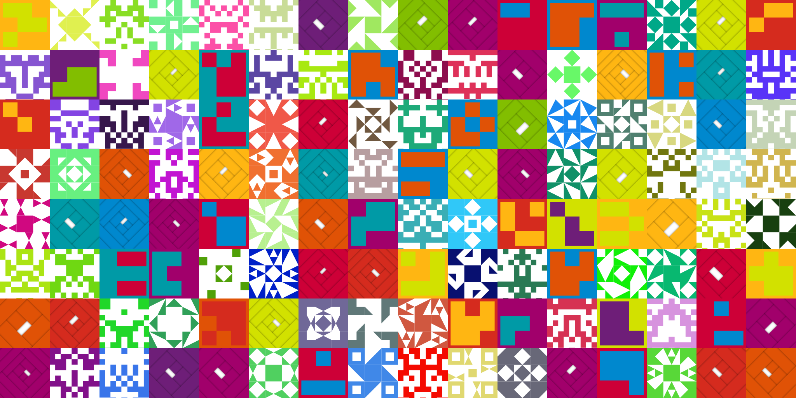
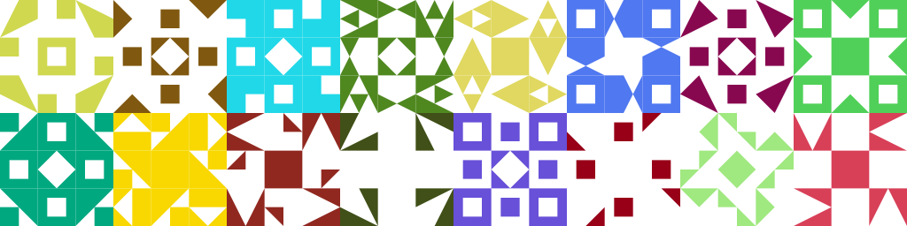

# Avatar Generator in Kotlin


---



## Dependency

### Apache Maven

```xml

<dependency>
    <groupId>top.fatweb</groupId>
    <artifactId>avatar-generator</artifactId>
    <version>1.0.0</version>
</dependency>
```

### Gradle

```groovy
implementation group: 'top.fatweb', name: 'avatar-generator', version: '1.0.0'
```

### Gradle (Short)

```groovy
implementation 'top.fatweb:avatar-generator:1.0.0'
```

### Gradle (Kotlin)

```kotlin
implementation("top.fatweb:avatar-generator:1.0.0")
```

## Usage

#### Configuration :

##### Kotlin

```kotlin
val avatar = Avatar.newBuilder()...build()
```

| Method                                                | Description                         |
|-------------------------------------------------------|-------------------------------------|
| elementRegistry(elementRegistry: ElementRegistry)     | Registry elements and groups        |
| size(size: Int)                                       | Set size of final image             |
| size(width: Int, height: Int)                         | Set width and height of final image |
| margin(margin: Int)                                   | Set margin of final image in pixel  |
| padding(padding: Int)                                 | Set padding of elements in pixel    |
| layers(vararg layers: ILayer)                         | Add layers to apply in elements     |
| color(vararg color: Color)                            | Set the color of all elements       |
| colorizeFunction(colorizeFunction: IColorizeFunction) | Set the color of element            |
| cache(cache: ICache)                                  | Set cache                           |

##### Java

```java
Avatar avatar=Avatar.newBuilder()...build()
```

| Method                                               | Description                         |
|------------------------------------------------------|-------------------------------------|
| elementRegistry(ElementRegistry elementRegistry)     | Registry elements and groups        |
| size(int size)                                       | Set size of final image             |
| size(int width, int height)                          | Set width and height of final image |
| margin(int margin)                                   | Set margin of final image in pixel  |
| padding(int padding)                                 | Set padding of elements in pixel    |
| layers(ILayer... layers)                             | Add layers to apply in elements     |
| color(Color... color)                                | Set the color of all elements       |
| colorizeFunction(IColorizeFunction colorizeFunction) | Set the color of element            |
| cache(ICache cache)                                  | Set cache                           |

#### Create :

##### Kotlin

```kotlin
avatar.create...()
```

| Method                                    | Description                           |
|-------------------------------------------|---------------------------------------|
| create(code: Long): BufferedImage         | Create avatar as BufferedImage        |
| createAsPngBytes(code: Long): ByteArray   | Create avatar as Png ByteArray        |
| createAsPngToFile(code: Long, file: File) | Create avatar as Png and save to file |

##### Java

```java
avatar.create...()
```

| Method                                       | Description                           |
|----------------------------------------------|---------------------------------------|
| BufferedImage create(long code)              | Create avatar as BufferedImage        |
| byte[] createAsPngBytes(long code)           | Create avatar as Png ByteArray        |
| void createAsPngToFile(long code, File file) | Create avatar as Png and save to file |

## Example

#### Kotlin

```kotlin
val seed = (Long.MIN_VALUE..Long.MAX_VALUE).random()

val avatar = Avatar.newBuilder().apply {
    elementRegistry(...)
    size(...)
    margin(...)
    padding(...)
    layers(...)
    color(...)
    colorizeFunction(...)
    cache(...)
}.build()

val bufferedImage = avatar.create(seed)
val pngBytes = avatar.createAsPngBytes(seed)
avatar.createAsPngToFile(seed, file)
```

### Java

```java
Avatar avatar=Avatar.newBuilder()
        .elementRegistry()
        .size()
        .margin()
        .padding()
        .layers()
        .color()
        .colorizeFunction()
        .cache()
        .build();
        BufferedImage bufferedImage=avatar.create(seed);
        byte[]pngBytes=avatar.createAsPngBytes(seed);
        avatar.createAsPngToFile(seed,file);
```

## Predefined avatar

### Triangle


#### Kotlin

```kotlin
val seed = (Long.MIN_VALUE..Long.MAX_VALUE).random()
val avatar = TriangleAvatar.newAvatarBuilder().build()
val bufferedImage = avatar.create(seed)
```

#### Java

```java
Avatar avatar=TriangleAvatar.newAvatarBuilder().build();
        BufferedImage bufferedImage=avatar.create(seed);
```

### Square


#### Kotlin

```kotlin
val seed = (Long.MIN_VALUE..Long.MAX_VALUE).random()
val avatar = SquareAvatar.newAvatarBuilder().build()
val bufferedImage = avatar.create(seed)
```

#### Java

```java
Avatar avatar=SquareAvatar.newAvatarBuilder().build();
        BufferedImage bufferedImage=avatar.create(seed);
```

### Identicon



#### Kotlin

```kotlin
val seed = (Long.MIN_VALUE..Long.MAX_VALUE).random()
val avatar = IdenticonAvatar.newAvatarBuilder().build()
val bufferedImage = avatar.create(seed)
```

#### Java

```java
Avatar avatar=IdenticonAvatar.newAvatarBuilder().build();
        BufferedImage bufferedImage=avatar.create(seed);
```

### GitHub


#### Kotlin

```kotlin
val seed = (Long.MIN_VALUE..Long.MAX_VALUE).random()
val avatar = GitHubAvatar.newAvatarBuilder().build()
val bufferedImage = avatar.create(seed)
```

#### Java

```java
Avatar avatar=GitHubAvatar.newAvatarBuilder().build();
        BufferedImage bufferedImage=avatar.create(seed);
```

## Related projects

---

+ [Avatar Generator](https://github.com/gabrie-allaigre/avatar-generator) - An avatar generator written in Java, but it
  has not been updated for a long time and has certain problems. Current project refers to it, rewrites it in Kotlin,
  and corrects some issues.